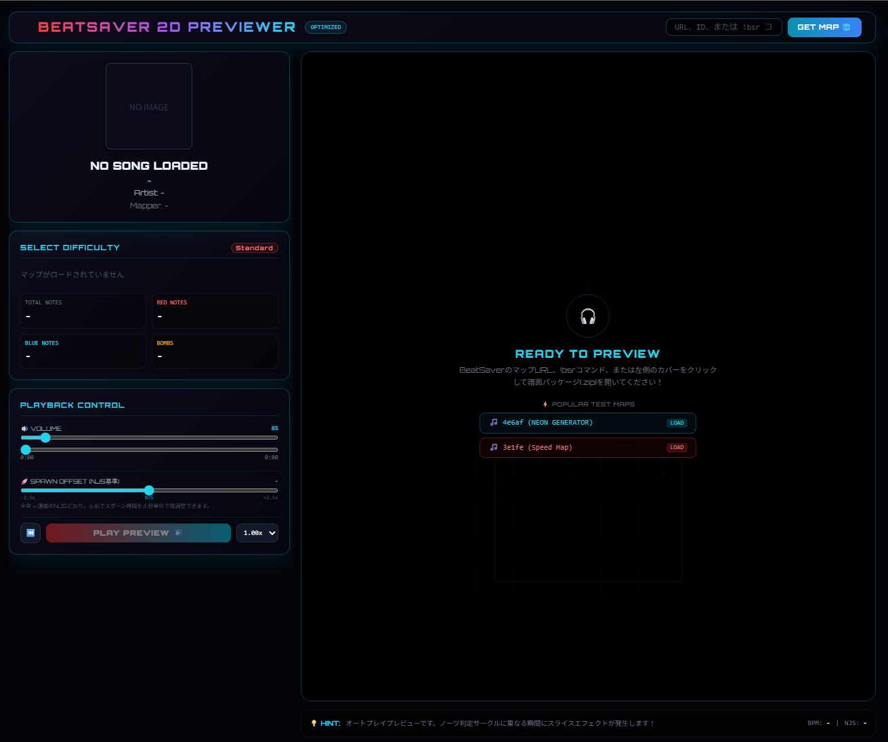

# BeatSaver 2D Previewer

Beat Saber 用の譜面を、ブラウザ上で **2D 俯瞰プレビュー** できる Web アプリです。

BeatSaver の URL・ID・`!bsr` コマンド、またはローカルの譜面 ZIP を読み込むと、曲に合わせてノーツが流れてくる様子を確認できます。VR ヘッドセットなしで、マッパーやプレイヤーが譜面の配置・タイミング・難易度をざっとチェックする用途を想定しています。

オートプレイのプレビューであり、実際にスライス操作をするゲームではありません。ノーツが判定位置に重なったタイミングで、カット方向に合わせたエフェクトと効果音が再生されます。
